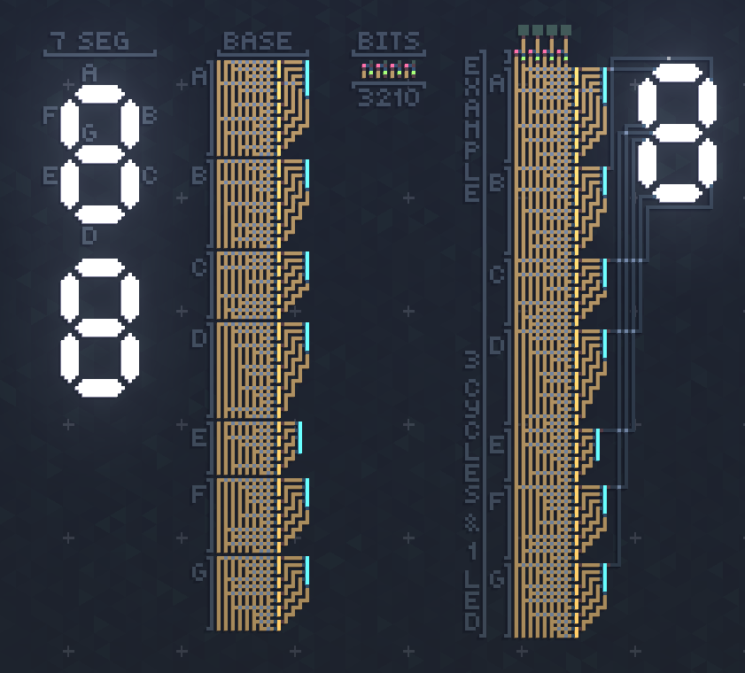

# Virtual Circuit Board - Parts

## 7 Segment Hexadecimal Display
Uses a single stage to go from bits to segment instead of the traditional 2 stage approach combining
a binary to decimal converter and ROM array.

### Links
* v1 - [Blueprint](nibble_to_hex_7_segment/v1.b64) - [Preview](nibble_to_hex_7_segment/v1.png)

### Credits
Used the schematics from [electronics-fun.com](https://electronics-fun.com/7-segment-hex-decoder/)
to preserve my sanity and avoid dealing with boolean algebra on paper.

### Screenshot

## License
[Unlicense](LICENSE)
